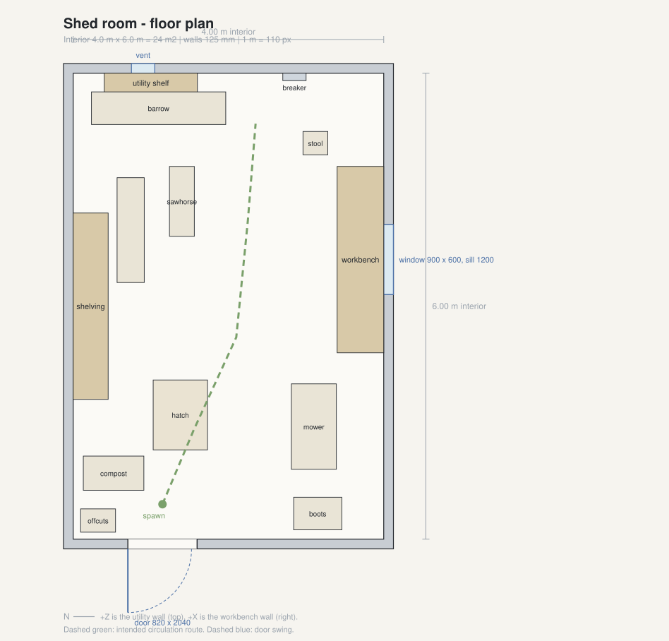

# Shed Room Demo

A walkable, realistically proportioned timber shed for Windows, built in Unity 6
with HDRP. This repository is one milestone: **the environment only**. There is
no game in it yet, and by design there should not be.

> **Status: the project is complete as source; it has not been opened in Unity.**
> It was authored in a Linux container that has no Unity installation and whose
> network policy blocks Unity's download servers, so the scene has never been
> generated, rendered, profiled or packaged.
>
> The C# *has* since been type-checked, and 31 of the 35 EditMode tests do run -
> against hand-written stand-ins for the Unity API rather than Unity itself
> (`./Tools/compile_check.sh`). Every HDRP call has separately been checked
> against HDRP's published source (`./Tools/verify_hdrp_api.sh`). Between them
> those two found six defects, three of which were hard compile errors. They
> say nothing about how any of this looks, bakes or performs. See
> [docs/KNOWN_ISSUES.md](docs/KNOWN_ISSUES.md).

---

## What this is

A 6 m x 4 m timber shed you can walk around and look at. It is framed the way a
real one is - piers, bearers, joists, floorboards, 90x45 studs at 600 mm
centres, a pitched roof on purlins under corrugated steel - and dressed as a
shed that somebody actually uses for gardening, repairs and storage.

It is deliberately ordinary. Nothing in it is haunted, abandoned or staged to
frighten anyone.

| | |
| --- | --- |
| Interior | 4.0 m wide x 6.0 m long x 2.4 m to the wall plate (24 m2) |
| Roof | 22 degree gable, ridge at 3.26 m, exposed rafters |
| Target | Windows 64-bit, 1920 x 1080, 60 fps on a mid-to-high-end PC |
| Engine | Unity 6 (6000.0 LTS) + High Definition Render Pipeline |
| Controls | WASD, mouse look, Ctrl/C to crouch, E to use or take, 1-6 to hold, G to put down, Esc to pause |



## Getting it running

You need Unity 6 with the **Windows Build Support (Mono)** module. Nothing else
is required - there are no paid assets, no Asset Store downloads and no accounts
to sign into.

```bash
# 1. Open the project folder in Unity Hub, let it resolve packages, then in the editor:
#      Freedome > Configure Project Settings
#      Freedome > Generate > Everything (textures, materials, scene)
#      Freedome > Validate Scene and Settings
#
# 2. Or do the whole thing headlessly, including the build:
./Tools/build_windows.sh --regenerate

# 3. Run the tests:
./Tools/run_tests.sh all

# 3a. Or type-check and run the Unity-free tests without Unity at all
#     (needs only dotnet-sdk-8.0 - no editor, no GPU):
./Tools/compile_check.sh

# 3b. Check every HDRP call against HDRP's published source. This is the only
#     check that says anything true about HDRP:
./Tools/verify_hdrp_api.sh

# 4. Regenerate the scale drawings and the preview renders after changing
#    any dimension:
python3 Tools/generate_diagrams.py
python3 Tools/preview_render.py
python3 Tools/export_web_walkthrough.py   # interactive WebGL page
```

The build lands in `Builds/Windows/ShedRoomDemo/ShedRoomDemo.exe`.

If the editor is not in a standard Unity Hub location, set `UNITY_PATH` first.

## How the room is built

Every dimension in the project comes from one file:
[`Assets/Game/Scripts/Environment/ShedDimensions.cs`](Assets/Game/Scripts/Environment/ShedDimensions.cs).
The scene generator, the automated tests and the scale drawings all read from
it, so the room, the documentation and the drawings cannot drift apart. Change
the wall height there and everything follows.

The scene itself is generated by editor code rather than placed by hand:

```
Freedome > Generate > Shed Room Scene
  -> ShedTextureGenerator   procedural tiling PBR maps
  -> ShedMaterialLibrary    23 HDRP/Lit materials
  -> ShellBuilder           floor platform, four stud walls, exterior ground
  -> RoofBuilder            rafters, purlins, corrugated sheet, eaves blocking
  -> OpeningsBuilder        door, window, vent
  -> FixturesBuilder        workbench, pegboard, shelving
  -> UtilityBuilder         consumer unit, conduit circuit, sockets, radio
  -> PropsBuilder           shelf contents, bench top, floor objects
  -> LightingBuilder        sun, volume stack, two practicals, probes
```

Geometry comes from `MeshBuilder`, which chamfers box edges and unwraps every
face planar in metres. Those two things do most of the work of stopping a
procedural room from reading as an untextured blockout.

## Repository layout

```
Assets/Game/
  Art/Textures/Generated   procedural PBR maps (regenerated, not committed)
  Editor/Generation        the scene generators
  Editor/Build             project configuration and the Windows build pipeline
  Editor/Validation        scene validator and the screenshot rig
  Materials                generated HDRP materials
  Models/Generated         generated mesh assets (regenerated, not committed)
  Prefabs, Audio           reserved; empty at this milestone
  Scenes/ShedRoom.unity    the main scene (generated)
  Scripts                  runtime: player, UI, settings, environment
  Settings                 HDRP asset, volume profile, lighting settings
  Tests/EditMode           dimensions, geometry, scene and project validation
  Tests/PlayMode           player collision, pause, spawn
Builds/Windows             build output
Tools                      build, test and diagram scripts
docs                       design documents, drawings, screenshots
```

## Documentation

| Document | What it covers |
| --- | --- |
| [docs/ROOM_DESIGN.md](docs/ROOM_DESIGN.md) | Dimensions, floor plan, circulation, prop groups |
| [docs/ART_DIRECTION.md](docs/ART_DIRECTION.md) | Material and detailing rules, and what is banned |
| [docs/LIGHTING.md](docs/LIGHTING.md) | Daylight, practicals, exposure, probes |
| [docs/FUTURE_GAMEPLAY_HOOKS.md](docs/FUTURE_GAMEPLAY_HOOKS.md) | The six affordances reserved for later, and why none of them show |
| [docs/ASSET_REGISTER.md](docs/ASSET_REGISTER.md) | Every asset, its origin and its licence |
| [docs/DECISIONS.md](docs/DECISIONS.md) | The choices worth arguing with, and why they went that way |
| [docs/KNOWN_ISSUES.md](docs/KNOWN_ISSUES.md) | What is unverified, what is a placeholder, what is likely to break first |
| [docs/BUILD_REPORT.md](docs/BUILD_REPORT.md) | Build path, procedure and results |
| [docs/previews/README.md](docs/previews/README.md) | Software-rasterised preview renders - what they are, and what they are not |
| [docs/RUNNING_IN_CLOUD.md](docs/RUNNING_IN_CLOUD.md) | Getting Unity running in a cloud session, and which acceptance criteria that would actually close |
| [docs/BUILDING_FROM_A_PHONE.md](docs/BUILDING_FROM_A_PHONE.md) | Compiling, testing and building via GitHub Actions with no desktop machine |
| [Tools/CompileCheck/README.md](Tools/CompileCheck/README.md) | Type-checking the project without Unity - what it proves, what it does not, and what it found |
| `Tools/verify_hdrp_api.sh` | Checks every HDRP symbol against Unity's published HDRP source. The one check the compile harness cannot do for itself |
| [TASKS.md](TASKS.md) | The milestone checklist and its real status |

## Scope

Implemented: first-person movement, mouse look, crouch, collision, gravity,
pause menu, graphics settings, restart, a packaged Windows build pipeline, and
a small amount of physical interaction - the door and the floor panel swing on
their hinges, the bench drawers slide open with things inside them, the switch
by the door works, and loose objects can be taken into a six-slot inventory and
put back down.

Deliberately **not** implemented, and not to be added: timer, game-over, object
combination, AI, escape-route logic, puzzles, journal, narrative clues,
dialogue, save system, combat, multiplayer, runtime generative AI, procedural
puzzle generation.

The inventory is a container and nothing more. No item has an effect, none can
be combined, none is required, nothing is counted or scored.

The line the interaction holds: **an interactable does something physical to
itself and nothing else.** Nothing sets a flag, unlocks anything, counts,
completes or is required. There is no objective in this project.

The environment reserves six architectural affordances for future escape
routes. Three of them now move, because a shed whose door does not open is a
diorama. None of them is highlighted, outlined, marked or hinted at. See
[docs/FUTURE_GAMEPLAY_HOOKS.md](docs/FUTURE_GAMEPLAY_HOOKS.md).

## Licence

Project code and generated art are original work in this repository. No
third-party assets are used. See [docs/ASSET_REGISTER.md](docs/ASSET_REGISTER.md).
